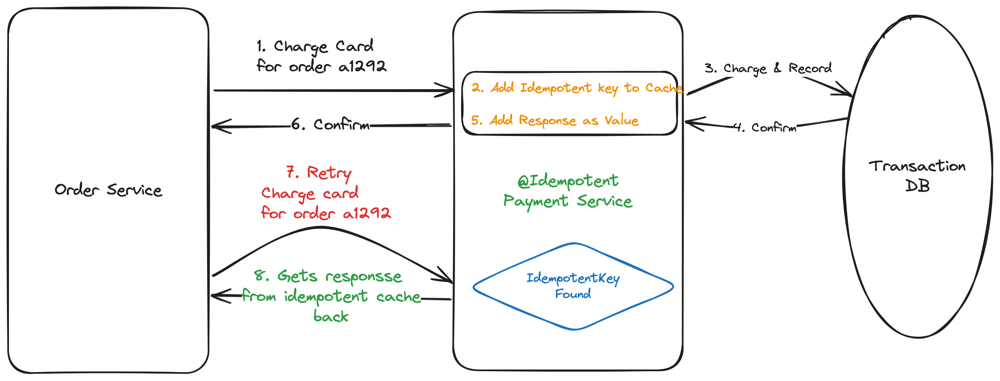

# Idempotent

Idempotent is a lightweight Java library that provides support for idempotency in APIs, making it easier to handle duplicate
requests and ensuring reliable operation in distributed systems. This library integrates seamlessly with Spring applications
and offers idempotency support using Redis and DynamoDB stores.




## What is Idempotency?
Idempotency is a property in computer science where an operation, when applied multiple times, has the same effect as
applying it once. In the context of APIs, an idempotent operation can be safely retried or replayed without causing
unintended side effects or altering the result beyond the initial application.

## How Idempotency Helps
Idempotency is crucial in distributed systems where network failures, retries, and out-of-order delivery are common.
By ensuring that requests are processed exactly once, idempotency prevents duplicate actions, maintains data integrity,
and improves overall system reliability.

In API development, idempotency helps in the following ways:

* **Prevents Duplicate Requests**: Idempotency ensures that repeated requests with the same parameters have no additional effect,
		reducing the risk of unintended side effects caused by duplicate processing.
* **Simplifies Error Handling**: With idempotent APIs, error handling becomes more straightforward as clients can safely retry
		failed requests without worrying about causing duplicate actions or data corruption.
* **Improves Scalability**: Idempotency allows systems to gracefully handle high loads and spikes in traffic by efficiently
		processing duplicate requests without overloading backend services or causing resource contention.

## Features
* **Two API Approaches**: Choose between annotation-based (AOP) or programmatic service-based idempotency depending on your needs.
* **Integration with Spring**: Seamlessly integrates with Spring applications, providing annotations and utilities to easily add idempotency support to APIs.
* **Support for [Redis](idempotent-redis/README.md) and [DynamoDB](idempotent-dynamo/README.md)**: Storage adapters for Redis and DynamoDB, allowing developers to choose the backend that best suits their requirements.
* **Simple Configuration**: Adding idempotency is as simple as annotating methods with [@Idempotent](idempotent-core/src/main/java/io/github/arun0009/idempotent/core/annotation/Idempotent.java) or using the `IdempotentService` programmatically.
* **Client-Specified or Server-Specified Idempotent Keys**: Clients can dictate what the idempotent key should be via a configurable HTTP header, or the server can specify the idempotency key specified in the @Idempotent annotation configuration.
* **Handling In-Progress Concurrent/Duplicate Requests**: Concurrent or duplicate requests will wait for the first request to complete (within a given configurable time frame and retries) and return the same response as the first request.

## Getting Started

### Annotation-Based Approach (AOP)

1. Add the Idempotent maven dependency([redis](https://central.sonatype.com/artifact/io.github.arun0009/idempotent-redis) or [dynamo](https://central.sonatype.com/artifact/io.github.arun0009/idempotent-dynamo)) to your project.
2. Configure the storage backend ([Redis](idempotent-redis/README.md) or [DynamoDB](idempotent-dynamo/README.md)) in your Spring application context.
3. Annotate the desired API methods with [@Idempotent](idempotent-core/src/main/java/io/github/arun0009/idempotent/core/annotation/Idempotent.java):
4. Specify the key, time-to-live (TTL) as a Duration string, and/or if you want to hash the key for idempotent requests.

```java
@Idempotent(
		key = "#paymentDetails",
		duration = "PT1M",  // 1 minute
		hashKey = true
)
@PostMapping("/payments")
public PaymentResponse postPayment(@RequestBody PaymentDetails paymentDetails) {
		// Method implementation
}
```

> **Note:** The `ttlInSeconds` parameter is deprecated. Please use the `duration` parameter instead, which accepts ISO-8601 duration strings (e.g., "PT1M" for 1 minute, "PT1H" for 1 hour).

### Service-Based Approach (Programmatic)

The service-based approach uses `Duration` for specifying TTL, providing better type safety and flexibility:

For more control or non-Spring applications, use the `IdempotentService`:

```java
@Service
public class PaymentService {

	@Autowired
	private final IdempotentService idempotentService;

	public PaymentResponse processPayment(String paymentId) {
			return idempotentService.execute(
					paymentId,
					"process-payment",
					() -> callPaymentGateway(paymentId),
					Duration.ofMinutes(30) // 30 minutes TTL as Duration
			);
	}
}
```

See the [core module documentation](idempotent-core/README.md) for detailed examples and usage patterns.
## Contributing
Contributions to Idempotent are welcome! Whether you want to report a bug, suggest a feature, or contribute code, please feel free
to open an issue or submit a pull request on GitHub.

By leveraging Idempotent in your Spring applications, you can ensure the reliability and integrity of your APIs, even in the face of
network failures and high concurrency. Start using Idempotent today to simplify error handling, improve scalability, and deliver a
more robust experience to your users.
