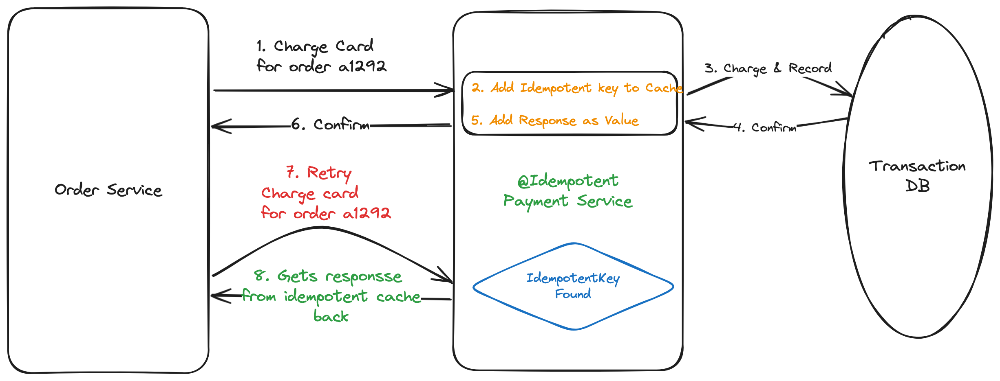

<div align="center">

# Idempotent

[](https://central.sonatype.com/search?q=io.github.arun0009%20idempotent)
[](https://opensource.org/licenses/MIT)
[](https://adoptium.net)
[](https://spring.io/projects/spring-boot)

</div>

**Run once. Same result on every retry.** A lightweight Spring Java library that makes any method or service safe to retry — not just HTTP APIs. Duplicate calls return the cached result; concurrent callers wait for the first run instead of racing.

Annotate a controller, a `@Service`, or a batch job. Or call `IdempotentService` directly. Pick **Redis**, **DynamoDB**, **NATS KV**, or **JDBC** — or start with the built-in in-memory store.

<div align="center">
	
</div>

```java
@Idempotent(key = "#order.id", duration = "30m")
@PostMapping("/orders")
public Receipt place(@RequestBody Order order) {
	return paymentGateway.charge(order);    // runs once, even on a retry storm
}
```

No bespoke locks. No “did this already happen?” checks. No duplicate work.

## Why your service needs Idempotent

In a distributed system, the same request can arrive **twice — or twenty times**. Networks time out, clients retry, load balancers replay, queues redeliver. Without idempotency, you ship the order twice, charge the card again, or corrupt state.

Idempotent ties every retry to **one logical operation**: same key → same outcome. It claims the key atomically, runs your code once, caches the result, and coordinates any concurrent callers — across **Redis, DynamoDB, NATS KV, or your SQL database**.

You add a dependency and an annotation. The library handles the hard parts.

## What you get

| | |
|---|---|
| **Two entry points, one engine** | `@Idempotent` on any Spring method, or `IdempotentService.execute(...)` from `@Service` classes, batch jobs, or message consumers. |
| **Atomic key claims** | Native primitives on every backend (`SET NX`, conditional `PutItem`, `kv.create`, `INSERT`) — two callers cannot both think they were first. |
| **Self-healing expiry** | Per-entry TTL, native backend TTL where available, lazy delete on read, scheduled cleanup for SQL. No zombie keys. |
| **Keys your way** | Client header (`X-Idempotency-Key`) or server-side SpEL (`#user.id`), with optional SHA-256 hashing. |
| **Honest semantics** | Domain exceptions propagate as-is. Null/void results are cached. Non-2xx `ResponseEntity` is removed so the client can retry. |

## How it works

Client sends the same request twice (timeout, retry, replay):

```http
POST /orders        X-Idempotency-Key: 1f3c1a93-…-3bd4
POST /orders        X-Idempotency-Key: 1f3c1a93-…-3bd4   ← duplicate
```

| Scenario | What happens |
|----------|--------------|
| First call | Claim key (`IN_PROGRESS`) → run your code → store `COMPLETED` |
| Duplicate **while in progress** | Poll with exponential backoff → return the same response |
| Duplicate **after success** | Cache hit — your method body does not run |
| Operation throws | Entry removed, exception propagates, retry allowed |
| Entry expired | Removed on next read; a new caller can claim the key |

> Set `duration` longer than your slowest operation, so an entry is never evicted mid-flight.

## Without AOP

Same engine from any code — useful in `@Service` classes, consumers, or jobs:

```java
return idempotentService.execute(
		"ord_42", "create-order", Order.class,
		() -> orderService.create(request),
		Duration.ofMinutes(30));
```

## Choose your storage

In-memory is the default. Pick a persistent backend for production:

| Module | Best for | Key primitive |
|--------|----------|---------------|
| **[Redis](idempotent-redis/README.md)** | Sub-ms reads, native TTL, already in your stack | `SET NX` / `SET XX` |
| **[DynamoDB](idempotent-dynamo/README.md)** | AWS-native, managed scale, table TTL | Conditional `PutItem` |
| **[NATS KV](idempotent-nats/README.md)** | KV co-located with your JetStream cluster | `create` + conditional `put` |
| **[RDS / JDBC](idempotent-rds/README.md)** | Postgres, MySQL, MariaDB, or H2 you already run | `INSERT` + scheduled cleanup |

All four share the same serialization, expiry, and state machine — swap backends without changing behavior.

## Install

Add a storage module (it pulls in `idempotent-core`):

```xml
<dependency>
	<groupId>io.github.arun0009</groupId>
	<artifactId>idempotent-redis</artifactId> <!-- or -dynamo, -nats, -rds -->
	<version>${idempotent.version}</version>
</dependency>
```

For `@Idempotent`, also add `spring-boot-starter-aop`. `IdempotentService` works without it.

API reference, configuration, and custom stores: **[idempotent-core](idempotent-core/README.md)**.

## Contributing

Issues and pull requests welcome at [github.com/arun0009/idempotent](https://github.com/arun0009/idempotent). Released under the [MIT License](https://opensource.org/licenses/MIT).
